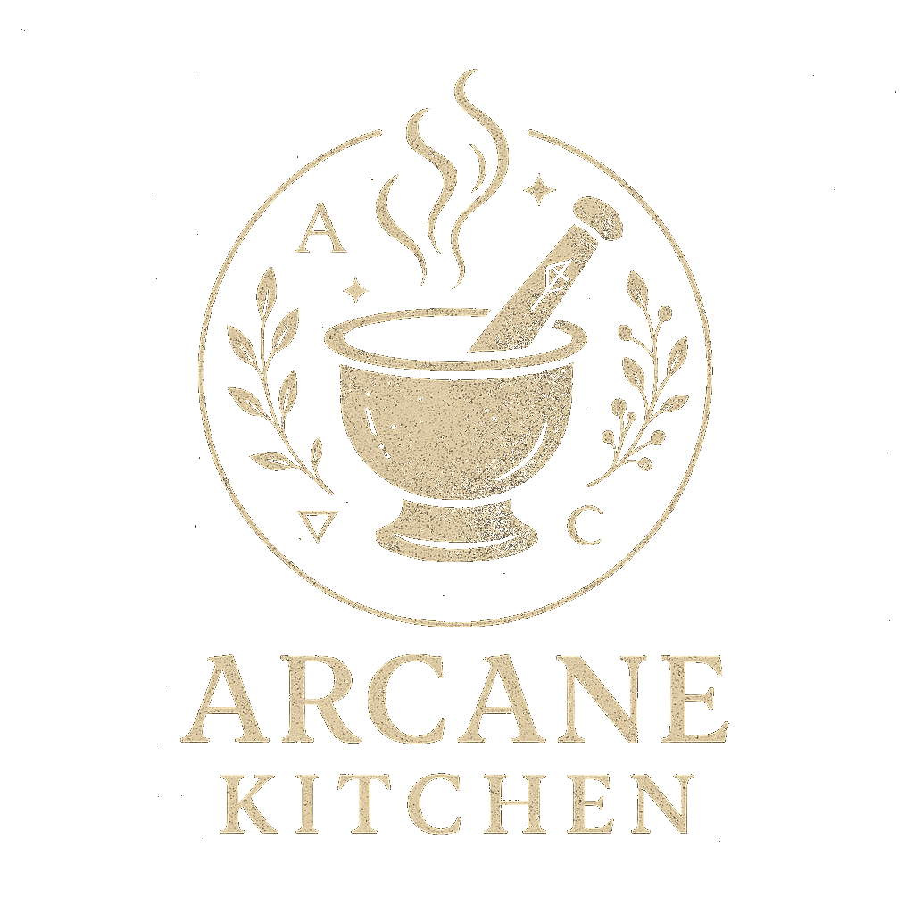

# Arcane Kitchen 🧙‍♀️✨

  

## About Arcane Kitchen

Arcane Kitchen is an AI-powered culinary companion that helps you explore recipes from around the world, customize them to your taste, and build your own virtual cookbook. Whether you're searching for traditional recipes from specific regions, experimenting with magical herb combinations, or looking to adapt dishes to dietary needs, our mystical Sous Chef AI is here to guide your culinary journey.

## ✨ Features

<table>
  <tr>
    <td width="50%">
      <h3>🔮 Recipe Discovery</h3>
      
Explore recipes by region, ingredient, dietary restriction, or magical property

    </td>
    <td width="50%">
      <h3>👨‍🍳 Mystical Sous Chef</h3>
      
Work with our AI to refine and customize recipes to your exact specifications

    </td>
  </tr>
  <tr>
    <td width="50%">
      <h3>⚗️ Alchemical Transformations</h3>
      
Convert recipes to accommodate dietary needs while preserving their essence

    </td>
    <td width="50%">
      <h3>📖 Grimoire of Recipes</h3>
      
Build and maintain your personal cookbook of magical culinary creations

    </td>
  </tr>
  <tr>
    <td width="50%">
      <h3>👥 Coven Community</h3>
      
Share your recipes with fellow kitchen witches and discover their creations

    </td>
    <td width="50%">
      <h3>🌿 Herbal Wisdom</h3>
      
Learn about the magical and medicinal properties of herbs and ingredients

    </td>
  </tr>
</table>

## 🧙‍♀️ The Magic Behind Arcane Kitchen

Arcane Kitchen combines the ancient art of cooking with modern technology to create a unique culinary experience:

- **Personalized Recipe Recommendations**: Our system learns your preferences and suggests recipes you'll love
- **Interactive Recipe Creation**: Collaborate with our AI to craft recipes tailored to your specific needs
- **Global Culinary Traditions**: Explore authentic recipes from cultures around the world
- **Seasonal Ingredients Guide**: Discover what's fresh and in season for your location
- **Dietary Accommodation**: Easily find and adapt recipes for any dietary requirement
- **Flavor Pairing Science**: Learn which ingredients work harmoniously together
- **Herbal Encyclopedia**: Access our extensive database of herbs and their culinary and magical properties

## 🌟 Community Features

Join our growing community of culinary enthusiasts:

- **Recipe Sharing**: Upload your own magical creations to share with others
- **Cooking Circles**: Form groups with like-minded kitchen witches to exchange ideas
- **Seasonal Celebrations**: Participate in special events tied to solstices, equinoxes, and harvest festivals
- **Ingredient Spotlights**: Learn about unusual ingredients and how to use them
- **Technique Tutorials**: Master both basic and advanced cooking methods
- **Virtual Cookbook Collections**: Create themed collections of your favorite recipes

## 🌱 Sustainable Cooking

Arcane Kitchen promotes sustainable and mindful cooking practices:

- **Seasonal Eating**: Guidance on cooking with locally available, in-season ingredients
- **Food Waste Reduction**: Tips and recipes to utilize every part of your ingredients
- **Ethical Sourcing**: Information on finding responsibly produced ingredients
- **Garden-to-Table**: Resources for growing your own magical herb garden
- **Preservation Techniques**: Learn traditional methods of preserving seasonal abundance

## 🚀 Getting Started

Visit [arcane.kitchen](https://arcane.kitchen) to begin your magical culinary journey. Create an account to save your favorite recipes, build your cookbook, and join our community of kitchen witches and wizards.

## 📜 License

This project is licensed under the Apache License 2.0. See the [LICENSE](LICENSE) file for details.

## 🤝 Contribution Guidelines

We welcome contributions from kitchen witches of all skill levels! View the [CONTRIBUTING.md](CONTRIBUTING.md) file for more information on how to join our coven of contributors.
